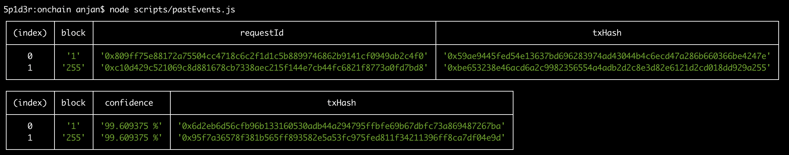

## DA OnChain Light Client

### Architecture


Data Availability onchain light client uses **Chainlink Oracle Network** to bring in respective block confidence from outer world.

Flow is like

- Invoke `requestConfidence(...)` while providing it with block number of interest
- It'll use chainlink oracle to send request to outer world, which will be eventually picked up by designated Oracle Node & fulfilled
- Before fulfilment, oracle node fetches confidence gained by specified Light Client for mentioned block & picks `serialisedConfidence` field's value from JSON response
- Sends onchain transaction fulfilling request, where as function payload, value for field `serialisedConfidence` is passed

Confidence serialisation is done using

> `(<block-number> << 32) | <confidence>`

in 32 bytes fixed space.

But confidence can't be represented as floating point number onchain, which is why it's represented out of 10 ** 9.

What offchain light client does, it first computes confidence out of 100 ( i.e. as percent ), puts it in `confidence` field & for `serialisedConfidence` field prepares it as `confidence * 10 ** 7` _( essentially out of 10 ** 9 )_

Now 10 ** 9 can be highest gained confidence for certain block, which can be easily represented with in **4 bytes**.

Remaining **28 bytes** from MSB side kept for putting block number.

---

Here's one visual


Deserialisation logic is written in `DAOracle.deserialise(...)`, which will be invoked when chainlink node will fulfil request.

Finally you can check `confidence` public associative array for querying confidence for guevn block number.

---

Primarily only one offchain oracle node is used for bringing block confidence, but more offchain nodes can be used.

Invoke `DAOracle.updateLightClient()`, with respective chainlink node's jobId & light client URL.

For setting up chainlink node, check [here](https://docs.chain.link/docs/running-a-chainlink-node/).

## Deployment Details

### Polygon Mumbai Test Network

Contract | Address
--- | ---
LINK Token | `0x70d1F773A9f81C852087B77F6Ae6d3032B02D2AB`
Chainlink Oracle | `0x1cf7D49BE7e0c6AC30dEd720623490B64F572E17`
DA Oracle | `0x2f81092a2EdA6897341f5c61586f2078d3987B5a`

## Usage

As a contract developer you probably want to use DAOracle for checking block confidence, which can be done by

- Invoking `requestConfidence` method --- **Fetches confidence via offchain oracle network**
- Querying `confidence` --- **Read min, max, latest confidence factors**

You can use this [interface](./contracts/IDAOracle.sol) in your smart contract

```js
interface IDAOracle {
    function requestConfidence(uint256 block_) external; // 1st
    function confidence(uint256 block_) external view returns (uint256, uint256, uint256, bool); // 2nd
}
```

When querying `confidence`, response looks like

> `exists` field will be `false` only when for block **B** confidence was never requested i.e. **No Record Found**

```json
[
    {
          "internalType": "uint256",
          "name": "max",
          "type": "uint256"
        },
        {
          "internalType": "uint256",
          "name": "min",
          "type": "uint256"
        },
        {
          "internalType": "uint256",
          "name": "recent",
          "type": "uint256"
        },
        {
          "internalType": "bool",
          "name": "exists",
          "type": "bool"
        }
]
```

But calling `DAOracle.requestConfidence` will revert if you haven't approved enough LINK token for Oracle to transfer to self.

Here's an [example](./contracts/DAConsumer.sol) smart contract demostrating how to interact with `DAOracle`.

1) First `approve(...)` DAOracle to use **X** LINK token
2) Invoke `requestDABlockConfidence(...)` with block number of interest
3) After request is fulfilled, invoke `queryDABlockConfidence(...)` to use block confidence for executing other business logic

> **X** LINK token >= #-of-times-block-confidence-requested *  10 ** 16

> Offchain oracle network may have **N** -active nodes, each of them to be requested for fetching block confidence

> Each offchain oracle node demands 10 ** 16 token for each block confidence request fulfilment

**Please note, `DAConsumer` is deployed on Mumbai Network at `0x0421dD5e69266DB488eFb8c2f3f504E8E67936D3`, with 1_000 LINK tokens --- _you can try aforementioned interaction yourself !_**

---

**For executing above interaction with `DAConsumer`**

- Invoke `approve(...)` method with 10 ** 16 as argument --- allowing DAOracle node to spend 0.01 LINK token on your behalf.
- Invoke `requestDABlockConfidence()` with 255 as argument --- request to bring confidence for block 255 of DA chain.
- Now wait for some time & run [👇](#utilities) script for checking whether your request has been fulfilled or not. 
- If you see something like 👇 **( newest at end )**, it denotes your request has been fulfilled & you can query it



- At last invoke `queryDABlockConfidence(...)` with 255 as block number, which will emit `BlockConfidence` event with **max**, **min**, **latest** confidence factors.

## Utilities

[Here's](./scripts/pastEvents.js) one handy script for querying `BlockConfidence` events, emitted by DAOracle, during request fulfilment phase.

```
node scripts/pastEvents.js
```
